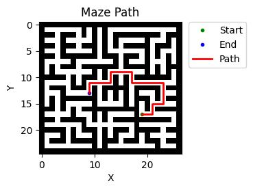

# Maze Solver

Maze Solver is a Python project that uses an A* pathfinding algorithm to find the shortest path through a randomly generated maze. The project also includes a maze generator based on a modified version of Kruskal's algorithm.

## Features
* Random Maze Generator
* A* Pathfinding Algorithm to solve the maze
* Maze and Path Visualizer
